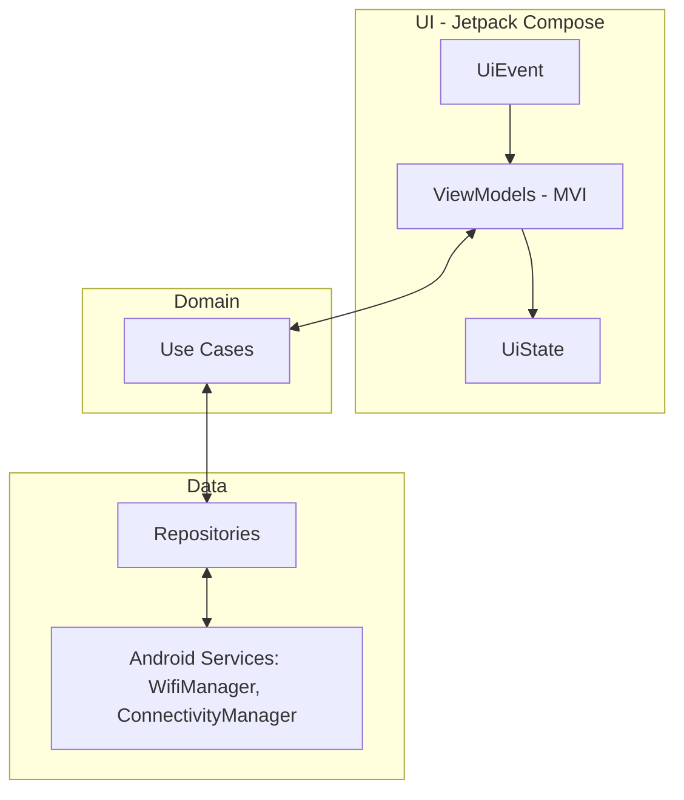

# Switchfi

> 📶 Smart Wi‑Fi switcher for Android that monitors signal strength and auto‑connects you to the strongest known network. ⚡ Battery‑friendly, seamless, and modern. 🧩 Kotlin + Jetpack Compose + MVI + Clean Architecture.

  
  
  
  

## Contents
- [Features](#features)
- [Tech Stack](#tech-stack)
- [Architecture](#architecture)
- [Requirements](#requirements)
- [Roadmap](#roadmap)
- [Contributing](#contributing)
- [License](#license)
 - [Theme](#theme)
 - [Localization](#localization)
 - [Settings](#settings)
 - [Known Networks](#known-networks)

## Features
- 🔁 **Auto‑switch to strongest known Wi‑Fi** using the platform’s Wi‑Fi Suggestions API (user‑approved, policy‑compliant).
- 🔋 **Battery‑friendly background logic** with lightweight observation and OS‑driven handoff.
- 📡 **Networks screen** listing current / known / nearby SSIDs with RSSI levels.
- 🔍 **Detail view** for each network: security type, signal trend, suggestion management.
- 🧭 **Single‑Activity + type‑safe Compose Navigation** (Navigation 2.8+).

## Tech Stack
| Layer | Choice |
|------|--------|
| Language | Kotlin |
| UI | Jetpack Compose, Material 3 |
| Architecture | Clean Architecture + MVI |
| DI | Hilt |
| Background | WorkManager |
| Navigation | Navigation Compose (2.8+ type‑safe destinations) |

## Architecture

- MVI primitives: `UiState`, `UiEvent`, `UiEffect` with reducer/intent flow.
- Clean separation of concerns across `ui/`, `domain/`, `data/`, optional `core/` utilities.

## Theme
- Light/Dark mode with Material 3 and dynamic color (Android 12+).
- User preference persisted via DataStore (`ThemeRepository`, `ThemeViewModel`).

## Localization
- English and Turkish resources under `values/` and `values-tr/`.
- App language switcher (runtime) backed by DataStore; uses `AppCompatDelegate.setApplicationLocales` on AndroidX.

## Settings
- RSSI threshold and hysteresis for auto-switch evaluation (DataStore-backed).
- Theme toggle available.

## Known Networks
- Add/remove known SSIDs (open/WPA2); persisted via DataStore.
- Suggestions synced with the list for platform-driven handoff.

## Requirements
- Android Studio Giraffe or newer
- Min SDK 26+ (TBD), Target SDK latest stable
- Permissions (subject to SDK level):
  - API 33+: `NEARBY_WIFI_DEVICES`, `ACCESS_FINE_LOCATION`, `ACCESS_WIFI_STATE`, `CHANGE_WIFI_STATE`
  - < API 33: `ACCESS_FINE_LOCATION`, `ACCESS_WIFI_STATE`, `CHANGE_WIFI_STATE`

## Roadmap
- [x] Project setup (Gradle, modules, MVI base)
- [x] Permissions & onboarding
- [x] Type‑safe Navigation graph
- [x] Light/Dark theme with preference
- [x] Localization (TR-ENG)
- [ ] Wi‑Fi Suggestions repository
- [ ] Background switching strategy
- [ ] Scan & measure (RSSI)
- [ ] Networks list screen
- [ ] Network detail screen
- [ ] Settings / Known networks
- [ ] Tests & CI

## Contributing
- Use feature branches and conventional commits.
- Run tests before opening PRs.
- Keep layers aligned with Clean Architecture (`domain/`, `data/`, `ui/`).

## License
TBD
